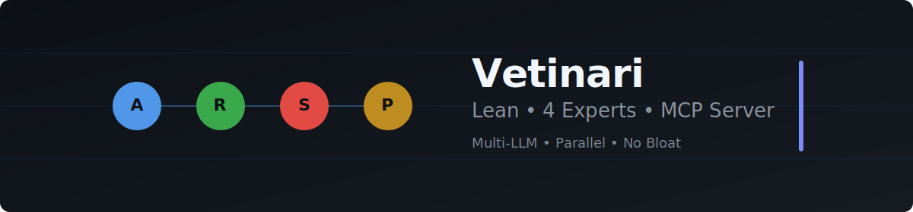

# 🧠 Vetinari — Multi-LLM Expert Advisor MCP Server

[](https://python.org)
[](https://github.com/modelcontextprotocol/python-sdk)
[](https://litellm.ai)
[](https://www.jetify.com/devbox)

<!-- Build & Quality Badges -->
[](https://github.com/maatini/vetinari/actions)
[](https://github.com/maatini/vetinari/actions)
[](LICENSE)

---



> Simple multi-expert MCP server for Cursor, Claude Code, and pi.  
> 4 experts, LiteLLM routing, parallel consultation. No bloat.

## Why?

Instead of asking a single LLM, get **4 specialized perspectives** in parallel on system design, code quality, security, and Python — all through one MCP server.

## Quick Start

```bash
# 1. Set up environment
devbox shell

# 2. Add at least one API key
cp .env.example .env  # Edit: OPENAI_API_KEY or ANTHROPIC_API_KEY or DEEPSEEK_API_KEY

# 3. Start server
devbox run server
```

## MCP Integration

Add to your `.mcp.json`:

```json
{
  "mcpServers": {
    "vetinari": {
      "command": "uv",
      "args": ["run", "python", "-m", "vetinari.server"],
      "cwd": "/path/to/vetinari"
    }
  }
}
```

## MCP Tools

| Tool | Description |
|---|---|
| `list_experts` | List/search all experts |
| `consult_expert` | Query a single expert |
| `consult_multiple_experts` | Query multiple experts in parallel ⚡ |
| `get_expert_prompt` | View an expert's system prompt |

## Experts

| ID | Focus |
|---|---|
| `architect` | System design, trade-offs, scalability |
| `reviewer` | Code review, debugging, quality & best practices |
| `security` | Threat modeling, OWASP, secure coding |
| `python` | Modern Python, typing, performance, idioms |

## Features

- **Startup validation** — server exits immediately with a clear error if no API key is configured
- **Resilient LLM calls** — LiteLLM automatically retries on rate limits, timeouts and transient errors. Cross-model fallback with exponential backoff + jitter. Fatal errors (content policy violations, context window exceeded) fail fast without unnecessary fallback attempts.
- **Smart model routing** — Tries your preferred model first, then falls back through a configurable chain (default: Claude 3.5 Sonnet → GPT-4o-mini → DeepSeek).
- **Parallel consultation** — `consult_multiple_experts` queries several experts at the same time using `asyncio.gather`, with a concurrency limit to reduce rate-limit pressure
- **Optional response cache** — enable with `ENABLE_CACHE=true` (in-memory, per-process, async-safe)
- **Usage tracking** — every response includes token counts and estimated `cost_usd` for the call

The three models are chosen for a good balance of quality, speed, and cost.

## Config (.env)

```bash
# At least one API key (required — server won't start without one)
OPENAI_API_KEY=sk-...
ANTHROPIC_API_KEY=sk-ant-...
DEEPSEEK_API_KEY=sk-...

# Optional
DEFAULT_MODEL=gpt-4o-mini
DEFAULT_TEMPERATURE=0.7
MAX_TOKENS=2048
ENABLE_CACHE=false

# Model fallback chain (comma-separated, tried after expert's recommended_model)
FALLBACK_MODELS=anthropic/claude-3-5-sonnet-20241022,gpt-4o-mini,deepseek/deepseek-chat

# LLM Resilience (optional)
LLM_MAX_RETRIES=2
LLM_RETRY_BASE_DELAY_SECONDS=0.5
LLM_TIMEOUT_SECONDS=90
LLM_MAX_CONCURRENT=4
```

## Dev

```bash
devbox shell             # Enter dev environment
devbox run test          # Run tests
devbox run test-cov      # Tests + coverage
devbox run lint          # Ruff
```
